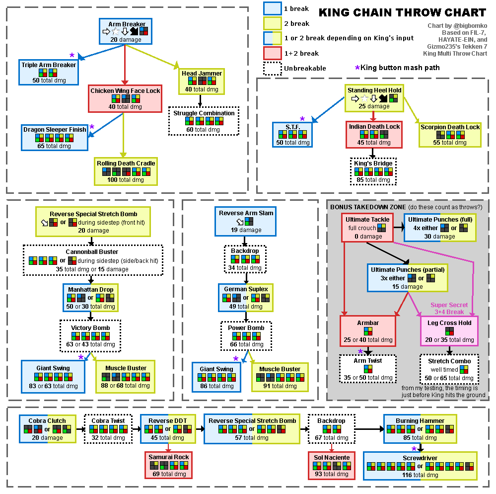

# Anti-King Notes

## Throw-Break Cheat Sheet
- Visually CD [1+2] Throws
    - Arm Breaker &rarr; RDC [MASH 2]
    - Heel Hold &rarr; King's Bridge [1+2]
- Visually (Blue Spark) [1+2] Throws
    - Gian Swing &rarr; [1]
    - Tomahawk/Shinning Wizard [1+2]
- Visually [1+2] Throws
    - Any other chainn throw [1 or 2]

## Move/String Counter-play

### Chain Throws

### Jaguar Sprint
- Hit him low to break the armor
- Throw him before he throws you
- Duck the Throw