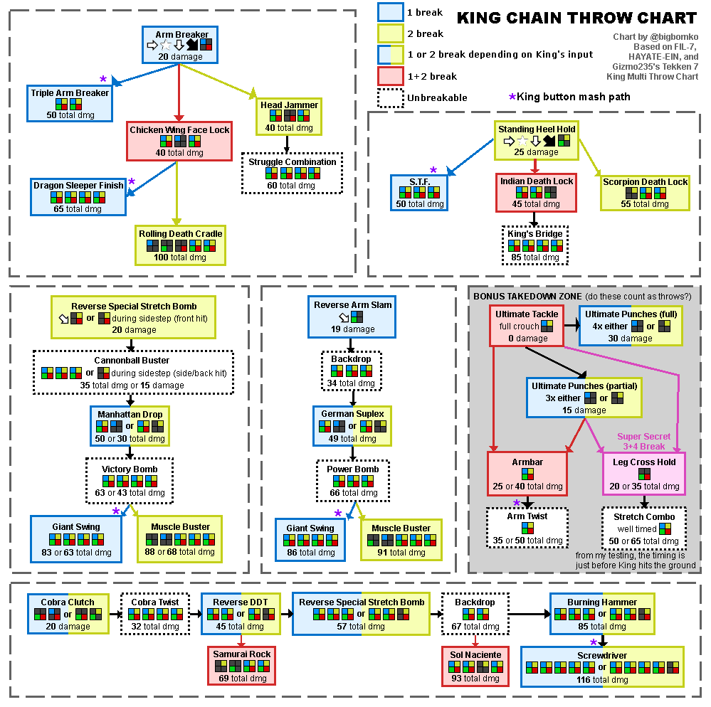

# Anti-King Notes

## General Strategy
- If he's running at you Side Walk to dodge is WR moves and be ready to
break shining wizard [1+2]
- Fuzzy guard the weird kicks &rarr; launch punish
- Evasive lows are pretty good against him

## Throw-Break Cheat Sheet
- Visually CD [1+2] Throws
    - Arm Breaker &rarr; RDC [MASH 2]
    - Heel Hold &rarr; King's Bridge [1+2]
- Visually (Blue Spark) [1+2] Throws
    - Gian Swing &rarr; [1]
    - Tomahawk/Shinning Wizard [1+2]
- Visually Slow CD or Spin [1+2] Throws
    - Any other chainn throw [1 or 2]

## Move/String Counter-play

### Chain Throws
- Visually (Blue Spark) [1+2] Throws
    - Gian Swing &rarr; usually buffered behind moves (DF1, D3, DB3)
    - Tomahawk/Shinning Wizard &rarr; usually done WR

### Jaguar Sprint
- Hit him low to break the armor
- Throw him before he throws you
- Duck the Throw

### Strings
- B1 &rarr; 2
    - Duck the second hit